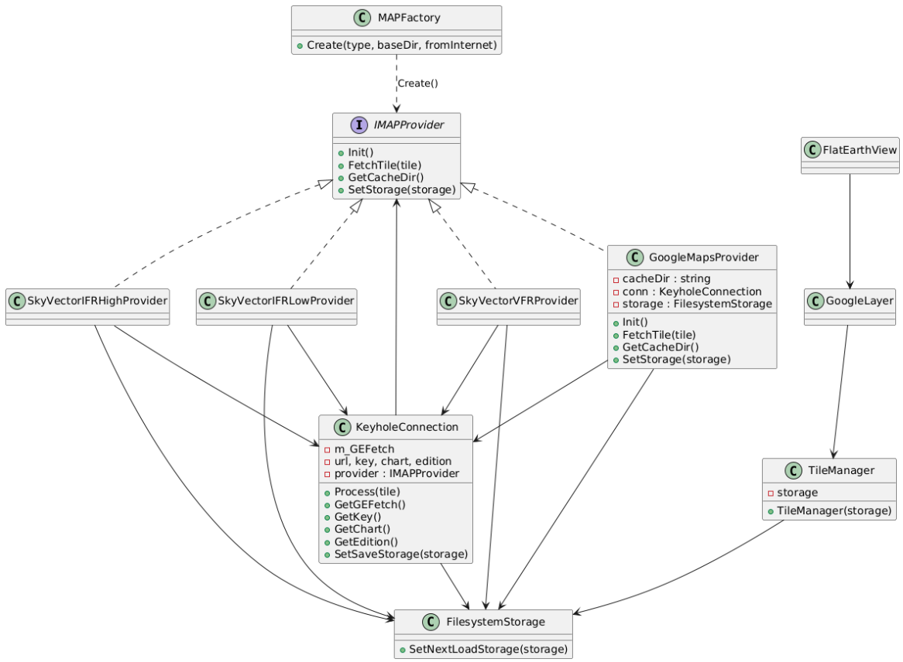

# ADS-B Display V4.2 리팩토링 요약
---
## 클래스 다이어그램

---

## 개요

이 프로젝트는 다양한 지도 소스(Google Maps, SkyVector 등)에서 타일을 다운로드하여 ADS-B 항공기 위치를 시각화하는 C++ Builder 기반 소프트웨어입니다.  
최근 리팩토링을 통해 지도 소스별 Provider 구조와 KeyholeConnection의 역할 분리가 이루어졌습니다.

---

## 주요 리팩토링 내용

### 1. 기존 구조

- **KeyholeConnection**이 지도 유형별 분기(if/else), 네트워크 처리, 타일 다운로드, 저장소 연동을 모두 직접 담당
- 지도 소스가 추가될수록 KeyholeConnection이 비대해지고 유지보수가 어려움

### 2. 리팩토링 후 구조

- **IMAPProvider 인터페이스** 도입  
  - 각 지도 소스별로 GoogleMapsProvider, SkyVectorVFRProvider 등 별도 클래스로 분리
  - 각 Provider가 KeyholeConnection을 내부적으로 생성 및 관리
- **KeyholeConnection**  
  - 지도 유형별 분기 제거, 생성 시 필요한 파라미터(url, key, chart, edition 등)를 Provider에서 전달받음
  - Process 함수는 Provider의 FetchTile을 호출하도록 개선 가능
- **MAPFactory**  
  - 지도 유형에 따라 적절한 Provider 객체를 생성하는 팩토리 패턴 적용
- **FilesystemStorage와의 연동**  
  - Provider에서 KeyholeConnection과 FilesystemStorage를 연결(SetSaveStorage, SetNextLoadStorage)
- **타일 처리 로직 분리**  
  - 타일 다운로드/파싱 등은 각 Provider의 FetchTile에서 담당

---

## 리팩토링 효과

- **유지보수성 향상**: 지도 소스별로 코드가 분리되어 수정/확장 용이
- **의존성 감소**: KeyholeConnection이 더 이상 지도 유형별 분기를 직접 처리하지 않음
- **확장성 강화**: 새로운 지도 Provider 추가가 쉬움
- **테스트 용이**: 각 Provider 단위로 테스트 가능

---